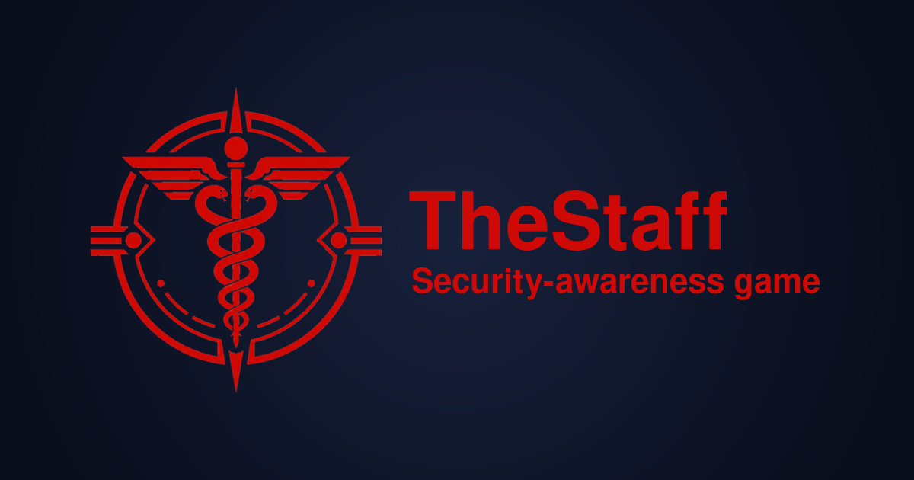
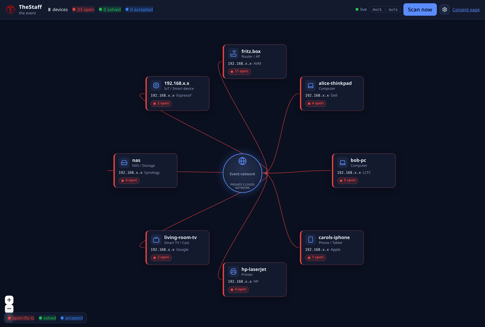

<p align="center">
  
</p>

A **consent-based, educational security-awareness game** for physical dev/maker events
(meetups, hackathons, game jams). Participants opt in by joining a dedicated challenge
WiFi; TheStaff scans the network, draws each guest's device as a live card in a
network diagram, and the organizing team coaches each person through **hardening their own
device** — turning findings from 🔴 *open* to 🟢 *solved* (or 🔵 *knowingly accepted*).

> ⚠️ **For authorized, consent-based security-awareness events only.** Operators must obtain
> venue/network-owner authorization and participant opt-in before any scanning. Unauthorized
> scanning may violate laws such as the CFAA (US), the Computer Misuse Act (UK), and GDPR.
> Read [`documentation/ETHICS.md`](documentation/ETHICS.md) and [`documentation/RULES_OF_ENGAGEMENT.md`](documentation/RULES_OF_ENGAGEMENT.md) first.

<p align="center">
  
</p>

> 📸 **Full screenshot tour** (CVE report, AI assistant, settings) on the project site:
> **<https://your-org.github.io/thestaff/>** — the static site in [`docs/`](docs/). Publish it via
> **Settings → Pages → Deploy from a branch → `main` / `/docs`**. *(Update the URL to your Pages address.)*

---

## What it does

- **Discovers** devices on your event LAN on a recurring schedule (nmap).
- **Fingerprints** each device's type — phone, laptop, printer, TV/cast, router, NAS,
  IoT, camera, console — from OS detection + MAC-OUI vendor + open-port heuristics.
- **Maps** open ports → services/versions → likely **CVEs** (nmap `vulners` online, with an
  offline `vulscan` CSV fallback, plus optional offline NVD enrichment).
- **Visualizes** everything as a live radial diagram of guest **cards** around a central
  "event network" hub. Card color = worst finding state: 🔴 open · 🟢 solved · 🔵 accepted.
- **Detail view** (click a card): every port & CVE, with CVSS/severity, a plain-language
  summary, **how to fix** suggestions, copy-pasteable **detection-only test commands**, and an
  **Accept** button (with confirmation) to record a knowingly-accepted risk.
- **Healthcheck loop**: a non-destructive, tiered "is it still there?" re-test that flips a
  finding to 🟢 green automatically once a guest closes a port or patches a service.

## How the game works

1. Guests connect to the challenge WiFi and see the **consent page** (honest opt-in, not a
   deceptive captive portal).
2. The team watches the **dashboard** (`/dashboard`) — new devices appear as red cards.
3. A team member sits with each guest, opens their card, and walks through each finding using
   the suggested fix steps and the "test it yourself" commands.
4. Guest fixes it → **Run healthcheck** → card turns 🟢. Can't/won't fix → **Accept** → 🔵.
5. Goal: every card green or blue by the end of the event. 🎉

## AI assistant (optional)

Each CVE can open an **interactive chat** that explains the finding and helps you verify the
fix — using **your own** Claude (Anthropic) or OpenAI key.

- **Add a key:** open **⚙ Settings** on the dashboard and paste a Claude and/or OpenAI key.
  Keys are stored **only in your browser** (localStorage) and sent **per request** to a thin
  backend proxy that forwards them to the provider — they are **never written to disk or logged**
  server-side. (A proxy is used because OpenAI blocks direct browser calls.)
- **Model management:** click **Discover models** to auto-list the models your key can use, pick
  one per provider, and choose a **default provider** with the radio. Switch model/provider any
  time from the chat header.
- **Ask AI:** once a key is set, every CVE shows an **Ask AI** button. The first message is sent
  for you and packs the full finding context — CVE id, CVSS, description, affected service/version,
  references, the **data source** (vulners/vulscan/NVD), and the target IP — then asks for a
  plain-language explanation and **non-destructive** steps to confirm whether it's still
  exploitable and how to verify the patch.
- **Conversations** are saved per-CVE (reopening shows the full history with no new API call);
  copy a message, copy the whole conversation, restart, full-screen, or clear history from the
  chat header.
- Disable the proxy entirely with `THESTAFF_AI_PROXY=0`.

**Privacy mode** (Settings) masks the last two octets of every IP — e.g. `192.168.x.x` — on the
diagram and in messages auto-sent to the AI, so a guest's address isn't shown on a shared screen
or sent to a third-party model. (Operator detail views and copy-paste test commands keep the real
address so the commands stay runnable.)

**Operator token:** when `THESTAFF_ADMIN_TOKEN` is set (required by `start.sh`/`update.sh`), all
mutating/active actions — scan, accept, healthcheck, wipe, **and AI** — need it. Paste the same
value into **⚙ Settings → Operator token**. See [Configuration](#configuration).

## Diagram controls

- **Add a device by IP** — the button at the top-left of the diagram adds an undetected host,
  or one outside the scan range (e.g. a dedicated server with a public IP). It appears
  immediately and is fingerprinted on the next scan. **Only add devices you are authorized to
  scan** — adding an IP makes the scanner nmap it. (IPv4 only for now.)
- **Select & remove** — drag on empty space to rubber-band-select devices (touching a card is
  enough; **Esc** clears). Press **Delete** to remove the selected cards and their findings;
  auto-detected devices reappear on the next **Scan now**, manually-added ones stay gone until
  re-added.

## Quick start

### Try it now (mock mode — no network, nmap, or container needed)

```bash
./scripts/dev.sh                       # backend (synthetic LAN) on :8000
# in another terminal:
cd frontend && npm install && npm run dev   # Vite on :5173 (proxies to :8000)
```
Open <http://localhost:5173/dashboard> — you'll see eight realistic synthetic devices with
real CVEs you can accept, healthcheck, and explore.

### Run it for real (container, at the event)

```bash
# 1) Create .env (gitignored) with a REQUIRED operator token — the deploy scripts refuse to run without it.
cp .env.example .env
sed -i "s|^THESTAFF_ADMIN_TOKEN=.*|THESTAFF_ADMIN_TOKEN=$(openssl rand -hex 24)|" .env

# 2) Build (rootless) + launch (rootful Podman, host net, CAP_NET_RAW; auto-detects the LAN).
sudo ./start.sh
# or pin the subnet:  echo 'TARGET_CIDR=192.168.50.0/24' >> .env   then   sudo ./start.sh
```
Then open `http://<host-ip>:8000`, and on the dashboard paste the token into **⚙ Settings →
Operator token** (it must match `.env`). Later rebuild + redeploy with `sudo ./update.sh`;
stop with `sudo ./stop.sh`. `start.sh`/`update.sh` build rootless and sync the image into root
storage automatically (see the note below).

The scan target defaults to `auto` — it detects the LAN subnet from the host's interfaces
(ignoring docker/bridge/wireguard/VPN). If several LANs are present it picks the default-route
one and logs the alternatives; override with `TARGET_CIDR` (in `.env`). (Optional, before the
event: `./scripts/fetch_nvd_feed.sh 2023 2024 2025` for offline CVE descriptions.)

> **Note on rootless vs rootful image stores:** if you `./scripts/build.sh` as your user
> (rootless) but run with `sudo` (rootful), the two have *separate* image stores. `run.sh`
> detects this and auto-copies the image into root's store (`podman save | sudo podman load`).
> To skip that, build into root's store directly with `sudo ./scripts/build.sh`.

**Why rootful?** nmap's raw-socket scans (ARP discovery, SYN scan, OS detection) cannot run in
a rootless container. TheStaff runs rootful with `--network=host` and **only**
`CAP_NET_RAW` (all other caps dropped, read-only rootfs, `no-new-privileges`) — never
`--privileged`. The process runs as root *inside* that locked-down container so nmap keeps the
capability.

**Supported architectures:** the prebuilt image targets **amd64** and **arm64** (incl. 64-bit
Raspberry Pi) — these have musllinux wheels for the compiled Python deps, so no toolchain is
needed. On other arches (e.g. 32-bit armv7) either build with a toolchain stage or switch the
base image to `python:3.12-slim`.

## Architecture

```
 Podman (rootful, --network=host, CAP_NET_RAW)
 ┌──────────────────────────────────────────────────────────────┐
 │ APScheduler ── scan_cycle() ── nmap (async subprocess)       │
 │      │                │                                      │
 │      │           parse (libnmap + ElementTree)               │
 │      │                │                                      │
 │      │      fingerprint → CVE map/enrich → reconcile         │
 │      │                │                                      │
 │      ▼          SQLite (WAL, SQLModel async)                 │
 │  ConnectionManager ──── broadcasts snapshot over WebSocket   │
 │  FastAPI (/api + /ws) ── serves the built Vue SPA            │
 └──────────────────────────────────────────────────────────────┘
                          ▲  Vue 3 + Vue Flow radial map (Pinia + WS)
```
See [`documentation/ARCHITECTURE.md`](documentation/ARCHITECTURE.md) for the full design.

## Tech stack

- **Backend:** Python 3.12, FastAPI, SQLModel + aiosqlite (WAL), APScheduler, python-libnmap.
- **Scanner:** nmap 7.95 with `vulners` + `vulscan` NSE; offline `fkie-cad/nvd-json-data-feeds`.
- **Frontend:** Vue 3 + Vite, `@vue-flow/core` diagram, Pinia store over a reconnecting
  WebSocket, `lucide-vue-next` icons.
- **Packaging:** Podman (Containerfile + Quadlet unit), host networking, minimal caps.

## Configuration

Runtime config for a deployment lives in a **gitignored `.env`** at the repo root (copy from
[`.env.example`](.env.example)). `start.sh`/`update.sh`/`run.sh` source it and **require**
`THESTAFF_ADMIN_TOKEN` — the operator token that gates every mutating/active endpoint (scan,
accept, healthcheck, wipe, AI). Generate one with `openssl rand -hex 24` and enter the same
value in the dashboard's **⚙ Settings → Operator token**. (Mock/dev via `./scripts/dev.sh`
stays open — no token needed.)

The full list of variables (with defaults) is in
[`backend/.env.example`](backend/.env.example). Key ones:
`THESTAFF_MODE` (`mock`|`real`), `TARGET_CIDR`, `SCAN_INTERVAL_MIN`, `THESTAFF_NSE`,
`THESTAFF_ORGANIZER`, `THESTAFF_SSID`, `THESTAFF_PUBLIC_IP_LOOKUP`
(`1`/`0` — show the network's public IP on the central node; `0` keeps it fully offline),
`THESTAFF_AI_PROXY` (`1`/`0` — the "Ask AI about this CVE" helper; the operator's
Claude/OpenAI key stays in their browser and is proxied per request, never stored).

## Project layout

```
backend/app/        FastAPI app, scan pipeline, models, routers, WebSocket
  scanner/          runner · parse · fingerprint · cve · reconcile · healthcheck · mock
frontend/src/       Vue app: views (Dashboard, Consent), components, Pinia store, libs
deploy/             Podman Quadlet unit
scripts/            dev · build · run · fetch_nvd_feed · update_oui · smoketest
documentation/      ETHICS · ARCHITECTURE · RULES_OF_ENGAGEMENT · CONSENT
docs/               GitHub Pages site (served at Settings → Pages → /docs)
```

## Tests / smoke check

```bash
PYTHONPATH=. .venv/bin/python scripts/smoketest.py   # full mock pipeline end-to-end
```

## License & responsibility

Licensed under the [MIT License](LICENSE).

The license grants broad reuse, but it does **not** waive your legal and ethical obligations:
you are responsible for lawful, **authorized, consent-based** use only. TheStaff is
detection-only and never exploits guest devices. Read [`documentation/ETHICS.md`](documentation/ETHICS.md) and
[`documentation/RULES_OF_ENGAGEMENT.md`](documentation/RULES_OF_ENGAGEMENT.md) before running it.
